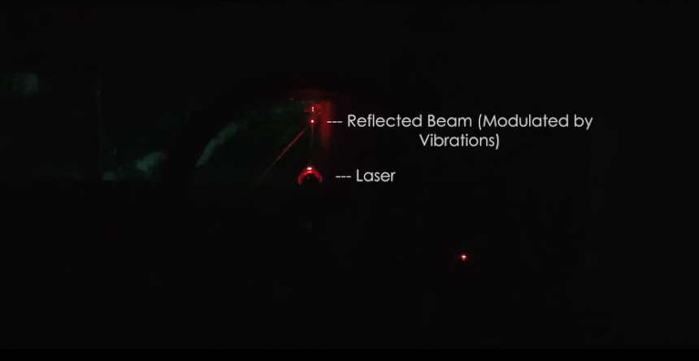
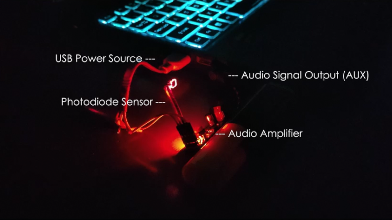
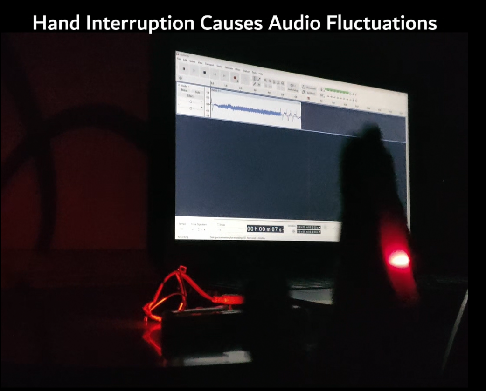
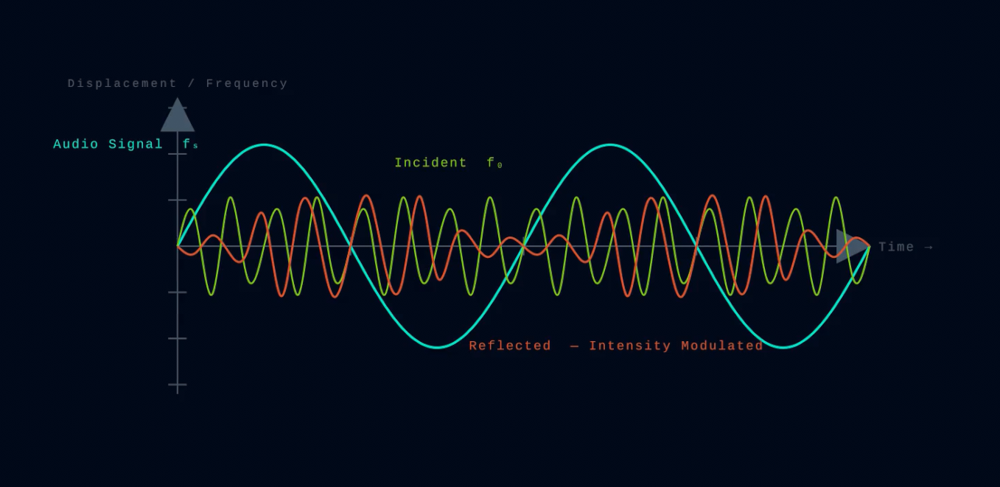
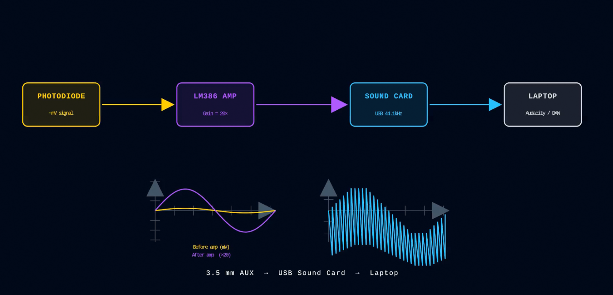
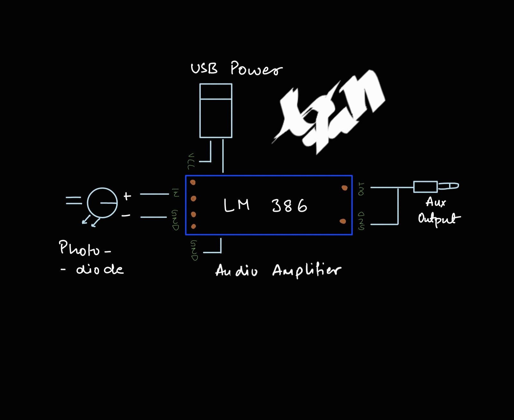
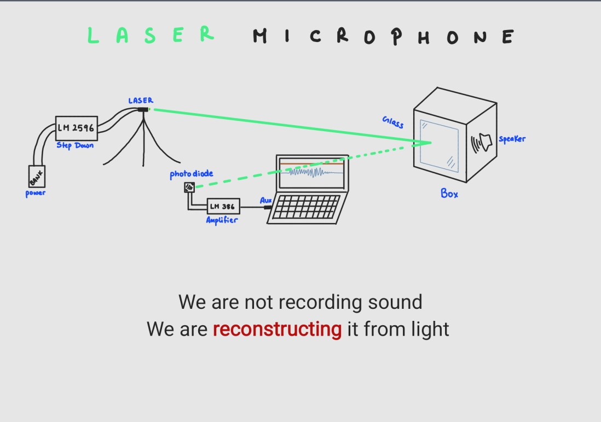

# Laser-Microphone
> Reconstructing sound from light using a custom laser and photodiode. 

---

## Overview
This project demonstrates how sound vibrations on a reflective surface such as glass or a window can be reconstructed using a laser beam, a photodiode sensor, and optical sensing principles.

A custom-modified laser module is powered through an LM2596 step-down converter, regulating the USB 5V supply down to a stable 3V input for consistent laser output.

Instead of recording sound directly, the system detects tiny fluctuations in reflected light caused by surface vibrations and converts them back into an audio signal.

---

## Project Media

### Animation / Working Principle
> Drive Link : [Access media here (Videos + images)](https://drive.google.com/drive/folders/1l8H-hZZI1A3veK387arMd_2Nyy2kBWVW?usp=sharing)

### Manim Explanation

### Circuit Diagram

### Workflow

### Output Samples
You can listen to reconstructed audio samples here:  
> Note the audio is completely reconstructed without any use of microphone or any recording device 

## Hardware Used
| Component | Purpose |
|----------|----------|
| Custom Laser Module | Sends steady 3V laser beam | 
| Photodiode | Detects reflected light | 
| LM386 Amplifier | Amplifies weak signal |
| LM2596 Step Down | Voltage regulation from 5V to 3V|
| AUX Output | Audio output |
| USB Power | Direct Power supply |

---

## Working Principle

1. Laser beam is directed at a reflective surface.
2. Sound causes microscopic vibrations on the surface.
3. Reflected laser intensity changes slightly.
4. Photodiode detects these changes.
5. LM386 amplifies the signal.
6. Audio is reconstructed through AUX output.

---

## Improvements
- Better noise filtering
- Long-distance testing
- DSP-based audio cleanup
- Higher sensitivity photodiodes
- Stable laser mounting

---

## Limitations
- Sensitive to vibrations
- Ambient light interference
- Requires accurate alignment
- Low signal strength

---

## Concepts Used
- Optical sensing
- Signal amplification
- Audio processing
- Photodiode response
- Vibration detection

---

## Author(build, design and execution)
Aryan 
